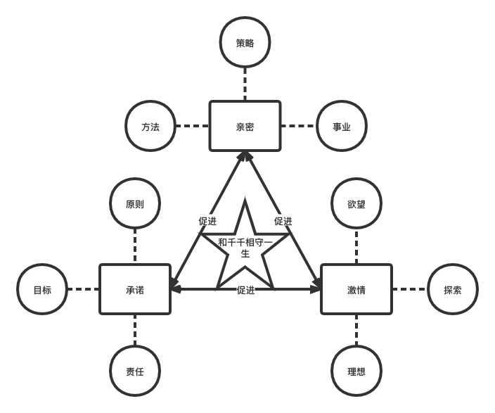
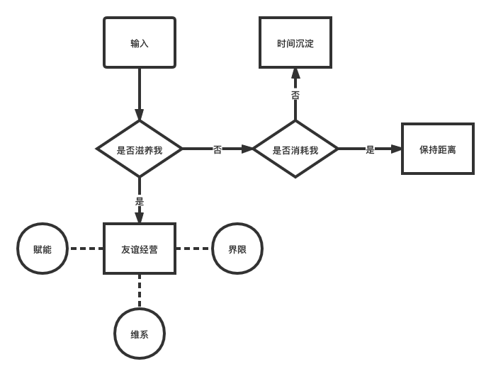

> 既表达真实的自我，也表达理念的自我。
> 
> 真实的自我是镜子，让自己脚踏实地的探索。
> 
> 理念的自我是构想，让自己天马行空的展望。

## 真实自我

### 自我描述
> 动物：欲望、冲动、生存、生命力。
> 
> 人：自我、自制、克制、意义、存在感、成就感、自我实现感、与世界链接、价值感、计算利弊。
> 
> 道：智慧、平静、顺其自然、幸福、美、敬畏。

自我：三分动物，五分人，二分道。

### 与世界碰触
> 我从来无法知道自己是个什么东西，除非让我与一些事物碰触。

- 与自我碰触
  - 安静内向，喜欢独处，抽离出来独自思考。
  - 有掌控感和生活节奏。
  - 偶尔被欲望所困扰。
  - 顺其自然，尊重客观规律。
  - 追问意义。
  - 记忆力不好，偶尔受到其困扰。
  - 追求幸福，幸福的体验是人生最大的价值。
  - 终身学习，从认知升级改造生活中获得乐趣。
- 与事业碰触
  - 喜欢厚积薄发，追求德要配位。
  - 渴望效率，有做事节奏，规划与战略。
  - 不想要受制于人，想要承担全部责任，也获取全部收益。
  - 急功近利，没有特别浓厚的研究心态。
  - 善于资源配置和方法论沉淀。
  - 善于迭代自己与进化。
  - 想要为他人赋能，渴望共赢。
  - 不喜欢的事情做不长。
- 与爱情碰触：女孩叫千千
  - 情种
    - 情到深处易动情。
    - 想要和千千相守一生的信念。
    - 多甜言蜜语，少行动。
  - 爱情的幸福快乐。
    - 体验过这份幸福快乐后，再难以被单纯的欲望所驱使。
  - 源自内心深处对她的祝福。
  - 真心的想要为她赋能。
  - 为女性安全而担忧，为女性平权而鼓劲。
  - 有想要和千千相守一生的欲望，想要竭尽全力的去争取。
- 与友谊碰触
  - 想要为朋友赋能，为他们做些什么。
  - 偶尔会想要在朋友面前彰显一些存在感。
- 与家庭碰触
  - 向往独立和自由。
- 与未知事物碰触
  - 敬畏。
  - 迷信。
  - 好奇与探索，尝试与碰触。

## 理念自我
> 你内心深处如何并不重要，你的所作所为决定了你是谁。 --克里斯托弗·诺兰 《蝙蝠侠：开战时刻》
> 
> 我内心深处极为重要，看清楚我的内心，我可以更好的做选择。我的选择，最终决定了我是谁。--武志红 《巨婴国》

### 相信与信仰
- 世界是可以没有剥削存在的，世界可以是人人平等的，消灭私有财产制。
- 人类是可以不用走优胜劣汰的社会达尔文路线的，人类的智慧便是机会，弱势群体需要被公平对待。
- 在人类的自驱力下，世界是可以很美好的。世界可以被主观意志所改造，积极的改造人类社会。
- 国是我的国，民族主义，捍卫国家和民族的利益。
- 因为淋过雨，所以也想为其他人打伞。
- 人民的幸福，而不是少数人的幸福，人民万岁。
- 共产主义并不剥夺任何人占有社会产品的权力，它只剥夺利用这种占有去奴役他人劳动的权力。

### 人格标准
- 活的真实，对自己和他人真实。

### 自我描述
我是自私的，我知道我个人的幸福源自和世界的良好关系，我知道人有核心需求-与世界链接的需求。
事业幸福-投入的去做一件事，深度的链接一件事。
爱情幸福-投入的去爱一个人，深度的链接一个人。
友谊幸福-投入的去关怀一群人，广度的链接一群人。

从而对应三个系统：事业系统、爱情系统、友谊系统。
理念自我便是化作推动这三个系统持续运转的能量，让此三个系统得以精彩的运转。
何为精彩的运转？让身处系统之中的人都因系统而受益。

### 事业系统
系统目标：数据、工程与商业化。

### 爱情系统
系统目标：千千和灰灰一辈子幸福快乐的生活在一起，并一起探索世界、体验世界、感受文化、享受生活、共同学习成长。

### 友谊系统

## 大事年表

## 附录
- 那些塑造过我的书与剧
  - [2020-2021那些塑造过我的书与剧]()
- 一周一次突破
  - [2020-2021一周一次突破](appendix/week-break/2020-2021-week-break)
  - [2019-2020一周一次突破](appendix/week-break/2019-2020-week-break)
  - [2018-2019一周一次突破](appendix/week-break/2018-2019-week-break)