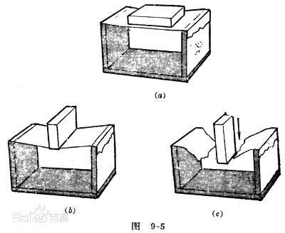
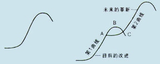

# 我的人生战略

## 时间线
- [x] 20200809 - V0.1 初稿
- [ ] 20201025 - V0.11 战略调整-主动退化

## 前言
事物的发展阶段大多数情况为 S 型曲线，投入期、增长期、衰落期。

## 宏观战略
每七年为自己规划一条 S 型曲线，坚定的走完整条曲线。全力投入 -> 单点破局 -> 收获增长红利 -> 收获衰减 -> 单一要素最大化拓展第二曲线。

## 初级阶段-单点破局

### 概念
- 压强
物体所受压力的大小与受力面积之比叫做压强。
压强用来比较压力产生的效果，压强越大，压力的作用效果越明显。
- 错位竞争
错位竞争策略是企业避开竞争对手的市场优势，以己之长击彼之短而确立相对优势竞争地位的一种竞争策略。
- 主动退化
将自己不擅长的领域主动退化掉，专注于自己擅长，可以事倍功半的领域。

### 方案
白手起家，一条改变自己命运的道路就是聚焦某个领域，在这个领域投入自己绝大多数资源。「绝对聚焦」。

与其说物理学中的压强，不如说商业中的饱和攻击。即利用自己尽可能多的资源去专注尽可能小且错位的领域，凭借此种方式尝试破局。力出一孔，尽可能的加快度过投入期的速度。
抓大放小，在将自己酿造成一瓶名贵醇厚的酒之前，不主动考虑感情问题。且向前去，前面更有动人风景。

#### 时间范围
第一个七年(2019-2026)

#### 资源
- 头脑
- 时间
- 钱
- 人脉

#### 领域
- 核心事业（研发工程师 & 战略规划）
    - 累计 10000 小时，形成强大竞争力。
- 写作
    - 周末随缘思考写作。
- 格斗
    - 健身与精力调节。

#### 退化领域
- 男女感情
  - 在将自己酿成一瓶白酒之前，不主动考虑感情的问题（至少 3 年，至 2023 年。）

## 中级阶段-第二曲线

### 方案

在第一曲线开始衰落之前预备开启第二曲线，防止人生整体的衰落。
将单一要素（战略规划）最大化扩大到第二曲线的全部。

#### 时间范围
第二个七年(2027-2034)

#### 资源
- 头脑
- 时间
- 钱
- 人脉

#### 领域
- 核心事业（创业 & 战略规划 & 投资）
    - 累计 10000 小时，形成强大竞争力。
- 写作
    - 周末随缘思考写作。
- 格斗
    - 健身与精力调节。

## 延伸阶段-第n曲线

### 方案
每七年一个核心业务。

#### 可拓展领域
- 投资
- 环球旅行
- 外语